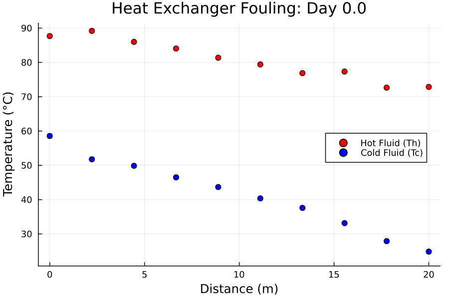
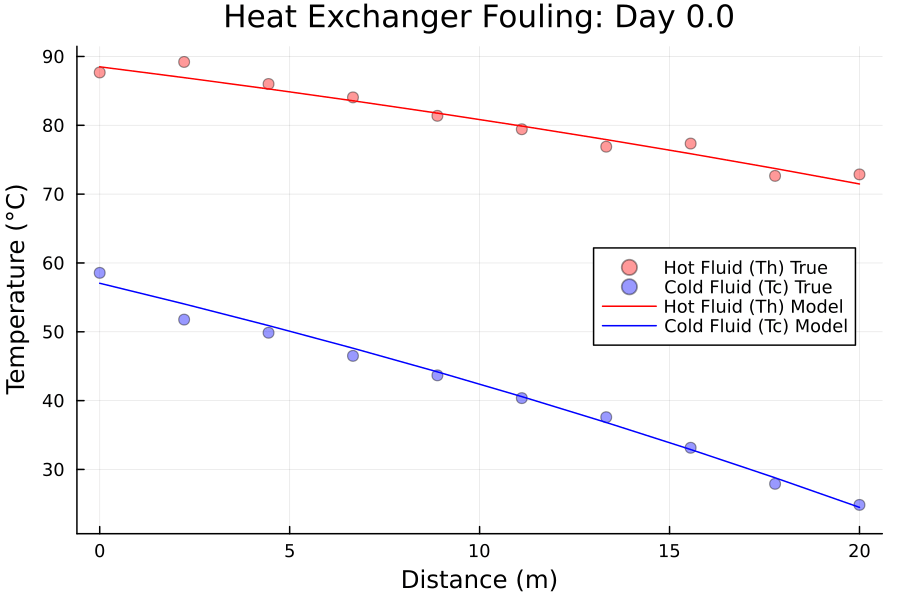
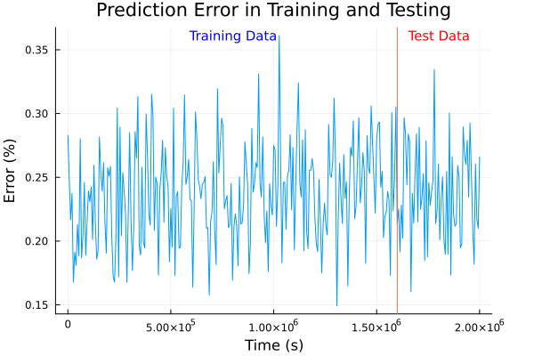

# HeatExchangeUDE


A physics informed model using the Universal Differential Equation (UDE) architecture to predict heat exchanger fouling rates from sparse noisy data. Embedding the neural network into a convective-advective energy balance creates a model which has a high sample efficiency, increased extrapolation accuracy and guarantees thermodynamic consistency. 

## Physical System
<p align="center">
   
   <br>
  <em>Figure 1: Theoretical Baseline Dataset. Resolution: 10 Spacial Nodes, 30 Timesteps</em>
</p>
This project models a counter current heat exchanger using an energy balance for the hot and cold streams. The energy balance considers the advective and convective terms of the heat transfer, neglecting conduction and hence assuming that the outer walls of the heat exchanger do not affect the heat transfer considerably: 

$$
    \frac{\partial T_h}{\partial x}+v_h\frac{\partial T_h}{\partial t} = -\frac{UP}{\rho_h c_{p,h} S_h}(T_h-T_c)
$$

$$
  \frac{\partial T_c}{\partial x}-v_c\frac{\partial T_c}{\partial t} = \frac{UP}{\rho_c c_{p,c} S_c}(T_h-T_c)
$$
During operation, a fouling layer builds up inside the heat exchanger degrading the ability for the convective heat transfer between the hot and cold streams. In theory this can be modelled by the Kern-Seaton model: 
$$
\frac{1}{U(t)}=\frac{1}{U_0}+R(t)
$$

$$
    R(t)=R_0(1-e^{\beta t})
$$

To better represent operational heat exchanger data, random gaussian noise is added to the simulated dataset to mimick random sensor noise from thermocouples.

## Practical Challenge
Heat exchanger fouling during operation can be highly unpredictable and detrimental to operation, leading to reduced efficiency or shutting down operation. Typically a cleaning and maintenance schedule at regular intervals is applied to ensure the process remains uncompromised. However this typically creates unnecessary operational expense as a margin of error is applied to be safe. 

Using a neural network, the underlying fouling patterns can be learned and applied to determine precisely when the equipment requires maintenance. Practically however this poses multiple difficult challenges. The amount of data obtained is relatively small and extremely noisy making conventional neural networks struggle to achieve high accuracy without overfitting.

## UDE Solution
<p align="center">
   
   <br>
  <em>Figure 2: Model Prediction Compared to True Dataset. Resolution: 10 Spacial Nodes, 30 Timesteps</em>
</p>

A universal differential equation (UDE), embeds a neural network into a differential equation. In this case the neural network predicts the rate of fouling inside the energy balance. This ensures that the physics of the system is enforced. Unlike a physics informed neural network which uses the physical equation in the loss function and approximates the entire behaviour which, if training fails, does not guarantee that the physics are followed. The UDE architecture allows for a neural network with few parameters which can be trained on a considerably smaller datasets than traditional convolutional neural networks. As the prediction follows the physical model the extrapolatory ability of UDE's can be highly accurate even without a regularisation in the loss function.

## Results
<p align="center">
   
   <br>
  <em>Figure 3: Spatial Average Model Prediction Error</em>
</p>

The results above were generated with a gaussian random error with standard deviation 1.0K. As can be seen the error oscillates around 0.25% which corresponds to the standard deviation of 1.0. The above data was generated with 80% being used to train the model and the last 20% being used to test the extrapolatory ability of the model.

The ratio of mean test error to the mean training error is 1.0 meaning the test and training accuracy are equal for this dataset.  

To ensure that the random noise is not overexaggerated from squaring and that the minimum point has a smooth second derivative for the LBFGS optimisation step, a pseudo huber loss function with a $\delta$ parameter equal to the standard deviation of the gaussian noise (1.0K) is minimised.   

## Future Work
To ensure the model is production ready the following work is being planned and structured:
- Deterministic unit testing of array dimensionality and gradient flow integrity
- Testing suite to ensure fouling remains strictly non-negative regardless of model input
- Stress test model with more severe and varied forms of noise (random spikes, sensor drift etc.)
- Train model on real operational heat exchanger data

## Reproducability
This code base is using the [Julia Language](https://julialang.org/) and
[DrWatson](https://juliadynamics.github.io/DrWatson.jl/stable/)
to make a reproducible scientific project named
> HeatExchangeUDE

To (locally) reproduce this project, do the following:

0. Download this code base. Notice that raw data are typically not included in the
   git-history and may need to be downloaded independently.
1. Open a Julia console and do:
   ```
   julia> using Pkg
   julia> Pkg.add("DrWatson") # install globally, for using `quickactivate`
   julia> Pkg.activate("path/to/this/project")
   julia> Pkg.instantiate()
   ```

This will install all necessary packages for you to be able to run the scripts and
everything should work out of the box, including correctly finding local paths.

To operate the program follow the instructions below (given that you have activated the project as above):

2. To generate datasets, open a Julia console and do:
   ```
   julia> using DrWatson
   julia> include(scriptsdir("DataGeneration.jl"))
   julia> GenerateTrainingTestData()
   ```

3. To train the model on the dataset you generated:
   ```
   julia> using DrWatson
   julia> include(scriptsdir("ModelTraining.jl"))
   julia> run_training()
   ```

4. To obtain the UDE prediction of the final trained parameters:
   ```
   julia> using DrWatson
   julia> include(scriptsdir("RunPrediction.jl"))
   julia> run_prediction()
   ```

## Repository Structure
```text
├── src/               # Core UDE architecture, loss functions, and physics models
├── scripts/           # Training loops, data generation, and plotting scripts
├── plots/             # Generated visualizations (GIFs, SVGs)
├── Project.toml       # Julia environment dependencies (DrWatson managed)
└── test/              # Unit tests and physical constraint checks
```

